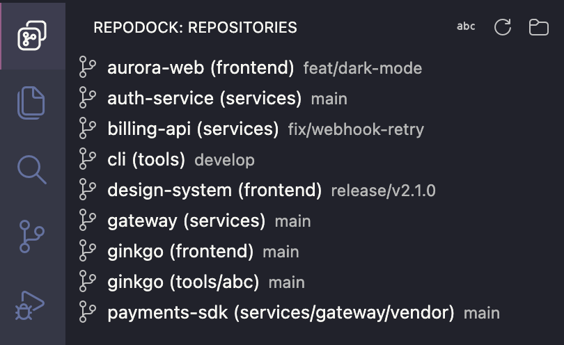

# RepoDock

Add folders, discover every git repository inside them, and switch between repos without leaving VS Code.

RepoDock scans the folders you choose, lists every repo in a native sidebar with live git status, and gets you into any of them in a couple of keystrokes.

## Contents

- [Features](#features)
- [Getting started](#getting-started)
- [Commands](#commands)
- [Settings](#settings)
- [Contributing](#contributing)
- [Support](#support)
- [License](#license)

## Features

- **Recursive discovery** — finds every git repo inside the folders you add, including nested repos and repos inside other repos (submodules, vendored checkouts).
- **Native sidebar** — a real VS Code tree in the Activity Bar, one row per repo. Repos below a folder's top level show their parent directory in parentheses (`ginkgo (abc)`) so same-named repos stay distinct.
- **Git state at a glance** — each row shows its branch and when you last opened it; the tooltip adds changes, untracked, and ahead/behind. Refreshes when the window regains focus.
- **Pin and hide** — pin daily drivers to the top; hide repos you never open.
- **You are here** — the repo open in the current window is highlighted and auto-revealed.
- **Sort your way** — order by most recently opened (compact `2h` timestamps) or alphabetically, from the title bar.
- **Group by folder** — give each scanned folder its own collapsible section; a repo under two overlapping folders appears once, in the more specific one.
- **Type-to-find** — focus the tree and type to filter.
- **Private by design** — no network, no telemetry, zero runtime dependencies; paths and timestamps stay in VS Code's local storage.

## Getting started

Requires VS Code 1.96 or newer.

1. Install [RepoDock from the Marketplace](https://marketplace.visualstudio.com/items?itemName=tylerdavidbailey.repodock) — or run `code --install-extension tylerdavidbailey.repodock`.
2. Open the RepoDock icon in the Activity Bar.
3. Click **Add Folder** and pick the directory (or directories) where your repos live.
4. Click any repo to open it — or focus the tree and type to filter.

## Commands

| Command                                                     | Description                                                             |
| ----------------------------------------------------------- | ----------------------------------------------------------------------- |
| `RepoDock: Manage Folders`                                  | List scan folders, remove one, or add another (title-bar folder button) |
| `RepoDock: Add Folder` / `Remove Folder`                    | The same, as direct commands                                            |
| `RepoDock: Refresh`                                         | Rescan folders and reload git state                                     |
| `RepoDock: Sort by Recently Opened` / `Sort Alphabetically` | Toggle the sort order                                                   |
| `RepoDock: Group by Folder` / `Show Flat List`              | Toggle folder sections (shown when several folders are configured)      |
| `RepoDock: Unhide All Repositories`                         | Clear the hidden-repo list                                              |

Repo rows also offer **Pin/Unpin**, **Open in Current Window** / **Open in New Window** (inline icon), **Add to Workspace**, **Open in Integrated Terminal**, **Reveal in Finder / File Explorer**, **Copy Path**, and **Hide Repository** via the context menu.

## Settings

| Setting                    | Default                                          | Description                                           |
| -------------------------- | ------------------------------------------------ | ----------------------------------------------------- |
| `repodock.directories`     | `[]`                                             | Folders to scan (`~` supported)                       |
| `repodock.maxDepth`        | `4`                                              | Directory levels to descend below each folder         |
| `repodock.exclude`         | `["node_modules", "bower_components", ".Trash"]` | Directory names skipped while scanning                |
| `repodock.hiddenRepos`     | `[]`                                             | Repos hidden via the context menu (`~` supported)     |
| `repodock.showNestedRepos` | `true`                                           | Show repos found inside another repo, nested under it |
| `repodock.sortOrder`       | `"recent"`                                       | `recent` (last opened first) or `alphabetical`        |
| `repodock.groupByFolder`   | `false`                                          | One section per configured folder instead of one list |
| `repodock.openInNewWindow` | `false`                                          | Open repos in a new window when clicked               |

## Contributing

Bug reports, feature ideas, and PRs are welcome — see [CONTRIBUTING.md](CONTRIBUTING.md) for setup, tests, and the commit conventions releases are generated from.

## Support

Found a bug or have a feature idea? [Open an issue](https://github.com/TylerDavidBailey/vscode-repodock/issues). For security concerns, follow the process in [SECURITY.md](SECURITY.md) rather than filing a public issue.

## License

[MIT](LICENSE)
