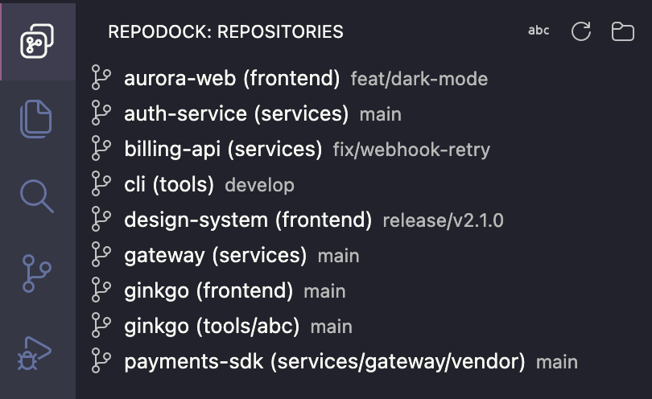

# RepoDock

Find every git repository inside the folders you add, and switch between them without leaving VS Code.

RepoDock scans the folders you choose and lists every repo it finds in a sidebar, with live git status. Clicking a row opens that repo.

## Contents

- [Features](#features)
- [Getting started](#getting-started)
  - [Install](#install)
- [Commands](#commands)
- [Settings](#settings)
- [Contributing](#contributing)
- [Support](#support)
- [License](#license)

## Features

- Finds every git repo in the folders you add, including repos inside other repos (submodules, vendored checkouts).
- Renders a tree view in the Activity Bar, one row per repo. A repo below a folder's top level carries its path under that folder in parentheses (`ginkgo (abc)`), so same-named repos stay distinct.
- Shows the branch and the time you last opened each repo. The tooltip adds changed and untracked counts plus ahead and behind.
- Reloads git status and rescans the folders when the window regains focus, so a repo you cloned in a terminal appears without a manual refresh.
- Pins the repos you use daily to the top. Hides the ones you never open.
- Highlights the repo that is open in the current window, and reveals it when the view opens.
- Sorts by most recently opened, with compact `2h` timestamps, or alphabetically. Both are in the title bar.
- Groups the list into one section per scanned folder, if you turn grouping on. A repo under two overlapping folders appears once, in the more specific one.
- Filters as you type once the tree has focus.
- Makes no network requests, collects no telemetry, and ships no runtime dependencies. Paths and timestamps stay in VS Code's local storage.

## Getting started

RepoDock requires VS Code 1.96 or newer.

### Install

Every release ships to both registries at the same version. Install from whichever one your
editor reads.

| Editor                                  | Registry                                                                                                   | Command                                                |
| --------------------------------------- | ---------------------------------------------------------------------------------------------------------- | ------------------------------------------------------ |
| VS Code                                 | [Visual Studio Marketplace](https://marketplace.visualstudio.com/items?itemName=tylerdavidbailey.repodock) | `code --install-extension tylerdavidbailey.repodock`   |
| VSCodium and other non-Microsoft builds | [Open VSX](https://open-vsx.org/extension/tylerdavidbailey/repodock)                                       | `codium --install-extension tylerdavidbailey.repodock` |

To install without a registry, download the `.vsix` from any
[GitHub release](https://github.com/TylerDavidBailey/vscode-repodock/releases) and run
`code --install-extension repodock-<version>.vsix`.

### Add your folders

1. Open the RepoDock icon in the Activity Bar.
2. Click **Add Folder** and pick the directory, or directories, where your repos live.
3. Click any repo to open it. To narrow the list, focus the tree and type.

## Commands

| Command                                                    | Description                                                                |
| ---------------------------------------------------------- | -------------------------------------------------------------------------- |
| `RepoDock: Manage Folders`                                 | List scan folders, remove one, or add another (title-bar folder button)    |
| `RepoDock: Add Folder`, `RepoDock: Remove Folder`          | Add or remove one scan folder directly                                     |
| `RepoDock: Refresh`                                        | Rescan the folders and reload git state                                    |
| `RepoDock: Sort by Recently Opened`, `Sort Alphabetically` | Set the sort order                                                         |
| `RepoDock: Group by Folder`, `Show Flat List`              | Turn folder sections on or off (shown when several folders are configured) |
| `RepoDock: Unhide All Repositories`                        | Clear the hidden-repo list                                                 |

The context menu on a repo row adds **Pin Repository** and **Unpin Repository**, **Open in Current Window**, **Open in New Window** (also an inline icon), **Add to Workspace**, **Open in Integrated Terminal**, **Copy Path**, and **Hide Repository**. It also adds **Reveal in Finder** on macOS, and **Reveal in File Explorer** on Windows and Linux.

## Settings

| Setting                    | Default                                          | Description                                           |
| -------------------------- | ------------------------------------------------ | ----------------------------------------------------- |
| `repodock.directories`     | `[]`                                             | Folders to scan (`~` supported)                       |
| `repodock.maxDepth`        | `4`                                              | Directory levels to descend below each folder         |
| `repodock.exclude`         | `["node_modules", "bower_components", ".Trash"]` | Directory names skipped while scanning                |
| `repodock.hiddenRepos`     | `[]`                                             | Repos hidden via the context menu (`~` supported)     |
| `repodock.showNestedRepos` | `true`                                           | Show repos found inside another repo                  |
| `repodock.sortOrder`       | `"recent"`                                       | `recent` (last opened first) or `alphabetical`        |
| `repodock.groupByFolder`   | `false`                                          | One section per configured folder instead of one list |
| `repodock.openInNewWindow` | `false`                                          | Open repos in a new window when clicked               |

## Contributing

Read [CONTRIBUTING.md](CONTRIBUTING.md) for setup, tests, and the commit conventions that releases are generated from.

## Support

[Open an issue](https://github.com/TylerDavidBailey/vscode-repodock/issues) for bugs and feature requests. For a security problem, use the private process in [SECURITY.md](SECURITY.md) instead.

## License

[MIT](LICENSE)
